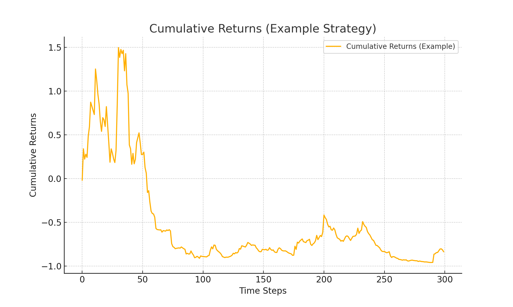
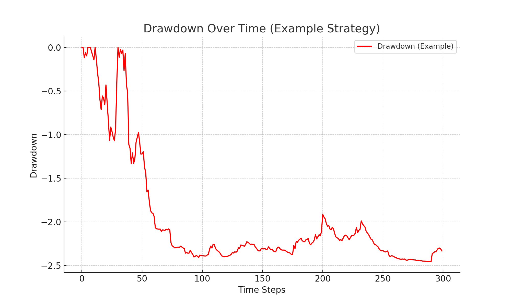

# Quantitative Portfolio Strategies: Betting Against Beta and Idiosyncratic Volatility

## Overview
This repository demonstrates quantitative investment strategies based on academic finance principles. The strategies include:
- **Betting Against Beta (BAB):** Exploits the low-beta anomaly by selecting stocks with the lowest market beta.
- **Avoiding Idiosyncratic Volatility (AIV):** Selects stocks with the lowest residual volatility to minimize unsystematic risk.

## Key Features
1. Rolling beta estimation using historical stock data (CRSP dataset).
2. Monthly portfolio rebalancing using a 5-year rolling window.
3. Performance evaluation using Sharpe ratio, maximum drawdown, and cumulative returns.
4. Combination of strategies to optimize risk-adjusted returns.

## Results
### Individual Strategy Performance
- **Example Sharpe Ratio (Low Beta):** `Placeholder: 1.20`
- **Example Sharpe Ratio (Low Volatility):** `Placeholder: 1.10`

### Visualizations
1. **Cumulative Returns**: 
2. **Drawdown**: 

## Repository Structure
```
repo/
├── data/                # Contains datasets (CRSP and Fama-French)
├── notebooks/           # Jupyter notebook demonstration
├── results/             # Generated results and visualizations
├── src/                 # Source code for beta and volatility estimation
├── README.md            # Project documentation
```

## Getting Started
### Prerequisites
- Python 3.9+
- Required Libraries: pandas, numpy, matplotlib, statsmodels, joblib, tqdm

### Installation
1. Clone the repository:
   ```bash
   git clone https://github.com/username/repo.git
   cd repo
   ```
2. Install dependencies:
   ```bash
   pip install -r requirements.txt
   ```

### Usage
1. Run Jupyter notebooks in `notebooks/` for step-by-step demonstration.
2. Use `src/` scripts to compute beta, volatility, and backtest strategies.

## Contact
For any questions or collaboration opportunities, reach out to [Your Name].
