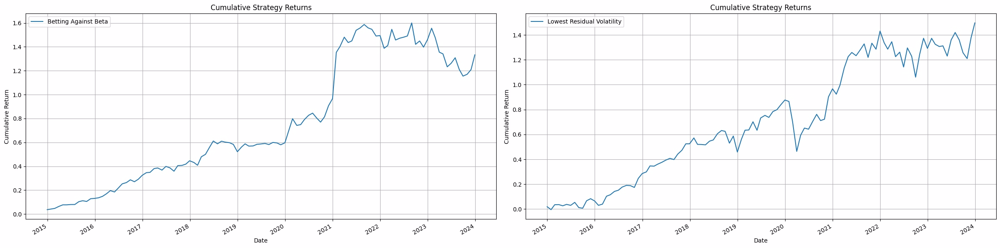
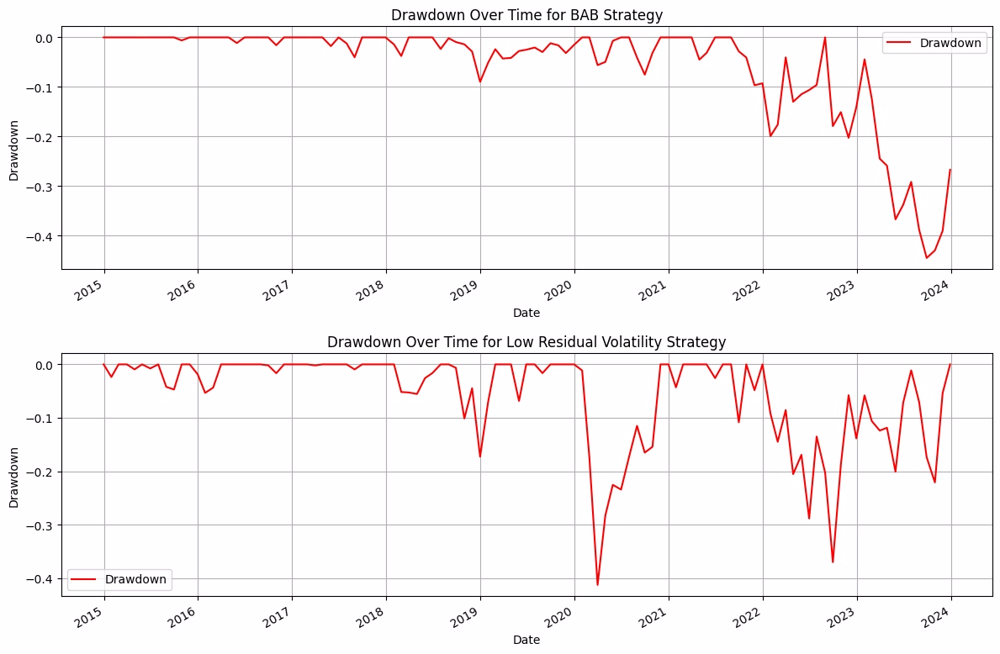

# Quantitative Portfolio Strategies: Betting Against Beta and Idiosyncratic Volatility

## Overview
This repository demonstrates two quantitative investment strategies based on academic finance principles:

1. **Betting Against Beta (BAB):** Exploits the low-beta anomaly by selecting stocks with the lowest market beta.
2. **Avoiding Idiosyncratic Volatility (AIV):** Selects stocks with the lowest residual volatility to minimize unsystematic risk.

Both strategies are evaluated using key performance metrics such as the Sharpe ratio and maximum drawdown. Additionally, we explore a combined strategy to optimize risk-adjusted returns.

---

## Results
### Individual Strategy Performance
- **Betting Against Beta (BAB):**
   - Sharpe Ratio: `0.95`
   - Maximum Drawdown: `-44.5%`
- **Avoiding Idiosyncratic Volatility (AIV):**
   - Example Sharpe Ratio: `0.81`
   - Example Maximum Drawdown: `-41.3%`

### Combined Strategy
- **Correlation Between Strategies:** `0.22`
- **Combined Strategy Sharpe Ratio (50% Allocation):** `1.1`
- **Optimal Weights for Combined Portfolio (Max Sharpe):**
  - BAB: `63%`
  - AIV: `37%`

---


### Visualizations
1. **Cumulative Returns**: 
2. **Drawdown**: 

## Repository Structure
```
repo/
├── data/                # Contains datasets (CRSP and Fama-French)
├── notebooks/           # Jupyter notebook demonstration
├── results/             # Generated results and visualizations
├── src/                 # Source code for beta and volatility estimation
├── README.md            # Project documentation
```

## Getting Started
### Prerequisites
- Python 3.9+
- Required Libraries: pandas, numpy, matplotlib, statsmodels, joblib, tqdm

### Installation
Clone the repository:
   ```bash
   git clone https://github.com/Vighnesh-Raj/Low_Beta_Idiosyncratic_Volatility.git
   cd repo
   ```

### Usage
1. Run Jupyter notebooks in `notebooks/` for step-by-step demonstration.
2. Use `src/` scripts to compute beta, volatility, and backtest strategies.

## Contact
For any questions or collaboration opportunities, reach out to me at vighnesh_raj@live.com.
